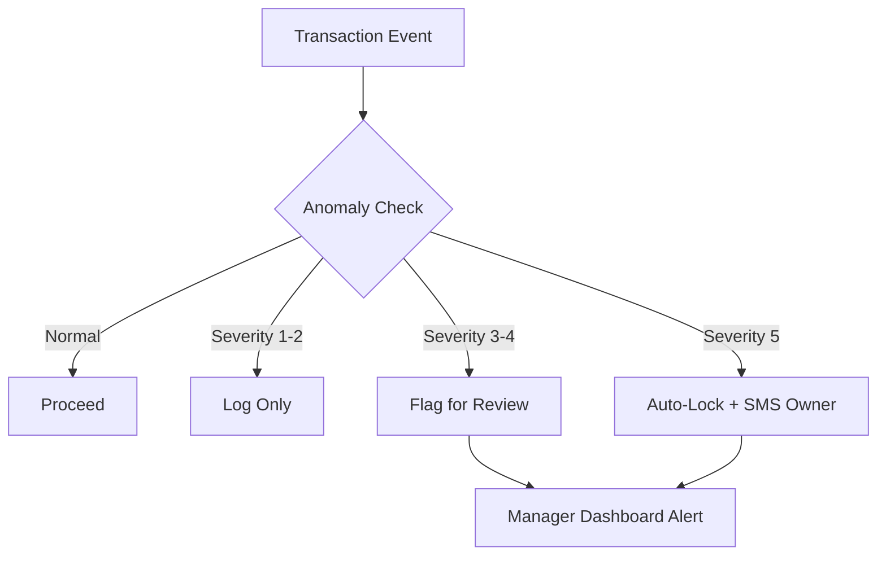

# Advanced Features Implementation Guide

## Overview
This module implements high-impact features designed specifically for African small traders:
1. **Business Health Score** (0-100 metric)
2. **AI Anomaly Detection** (Fraud prevention)
3. **USSD Fallback** (Feature phone support)
4. **Group Buying** (Cooperative procurement)
5. **WhatsApp Catalog** (Social commerce)

---

## 1. Business Health Score Engine

### Concept
A single 0-100 number summarizing business viability, similar to a credit score but for internal use.

### Scoring Algorithm
| Component | Weight | Key Metric | Ideal Range |
|-----------|--------|------------|-------------|
| **Liquidity** | 30% | Cash / Payables | > 1.5 |
| **Inventory** | 25% | Stock Turn Days | 15-30 days |
| **Growth** | 25% | MoM Revenue Growth | > 10% |
| **Compliance** | 20% | Tax Filing + Anomaly Resolution | 100% |

### Calculation Flow
```python
# Daily cron job at 2 AM
for store in all_stores:
    health = BusinessHealthService.calculate_daily_health(store.id)
    db.save(health)
    
    if health.overall_score < 40:
        send_alert(store.owner, f"⚠️ Business Health Critical: {health.overall_score}/100")
```

### Dashboard UI Mockup
```
┌─────────────────────────────────────┐
│  BUSINESS HEALTH SCORE              │
│                                     │
│      ╭───────────────╮              │
│      │      72       │  ← Green if >60
│      │   GOOD        │     Yellow 40-60
│      ╰───────────────╯     Red <40
│                                     │
│  Liquidity:    ████████░░  80/100   │
│  Inventory:    █████░░░░░  50/100   │
│  Growth:       ███████░░░  70/100   │
│  Compliance:   █████████░  90/100   │
│                                     │
│  💡 Recommendation:                 │
│  "Review slow-moving stock items"   │
└─────────────────────────────────────┘
```

---

## 2. AI Anomaly Detection System

### Detection Rules

#### A. Velocity Spike (Fake Sales)
**Trigger**: Cashier processes >3σ (standard deviations) above their normal rate.
- **Use Case**: Preventing cashiers from creating fake sales to balance cash shortages.
- **Action**: Flag for manager review, auto-lock account if severity=5.

#### B. Negative Margin Alert
**Trigger**: Sale Price < COGS (without active promotion).
- **Use Case**: Catching pricing errors or intentional theft via underpricing.
- **Action**: Require manager PIN override for future transactions.

#### C. Duplicate Refund
**Trigger**: Same refund amount + original sale ID within 24 hours.
- **Use Case**: Preventing double-dipping on customer refunds.
- **Action**: Block second refund automatically.

#### D. Off-Hours Login
**Trigger**: Admin login outside configured operating hours.
- **Use Case**: Detecting unauthorized after-hours access.
- **Action**: Send SMS alert to owner immediately.

### Database Integration
```sql
-- When anomaly detected, insert into security_anomalies
INSERT INTO security_anomalies 
(tenant_id, user_id, anomaly_type, severity_level, evidence_data)
VALUES 
('store-uuid', 'cashier-uuid', 'velocity_spike', 4, 
 '{"z_score": 3.5, "current_rate": 15, "avg_rate": 5}');
```

### Automated Response Workflow


---

## 3. USSD Fallback System

### Architecture
Since smartphones and data are not universal, USSD (*123#) ensures continuity.

### Session State Machine
```
[START] → MAIN_MENU
   ├─ 1 → MAKE_SALE → ENTER_PRODUCT → ENTER_QTY → CONFIRM → [END]
   ├─ 2 → CHECK_STOCK → ENTER_PRODUCT → [END]
   ├─ 3 → MY_BALANCE → [END]
   └─ 4 → EXIT
```

### Technical Constraints
- **Session Timeout**: 5 minutes of inactivity
- **Max Depth**: 4 levels (to avoid user frustration)
- **Input Validation**: Strict numeric menus to prevent errors

### Example Flow
```
User dials: *123#
System: Welcome to POS. 
        1. Make Sale
        2. Check Stock
        3. Balance
User: 1
System: Enter Product Code:
User: 1001
System: Rice 5kg. Enter Qty:
User: 2
System: Total ₦5000. Confirm? 1.Yes 2.No
User: 1
System: Sale Complete. Receipt sent via SMS.
```

### Backend Handler (Python/FastAPI)
```python
@app.post("/ussd/session")
async def ussd_handler(phone: str, text: str, sessionId: str):
    if text == "":
        # New session
        return USSDResponse("CON 1. Make Sale\n2. Check Stock")
    
    if text == "1":
        return USSDResponse("CON Enter Product Code:")
    
    # Continue state machine...
```

---

## 4. Group Buying (Cooperative Procurement)

### Business Logic
Small retailers lose out on bulk discounts. This feature pools orders.

### Workflow
1. **Initiation**: Store A creates a pool for "Rice 5kg", target 100 bags.
2. **Propagation**: Pool shared via WhatsApp to nearby stores.
3. **Contribution**: Stores B, C, D commit to 20, 30, 50 bags respectively.
4. **Closure**: Once target hit (or deadline), pool closes.
5. **Fulfillment**: Supplier delivers to organizer; sub-stores collect.

### Database Schema Usage
```sql
-- Create Pool
INSERT INTO group_buying_pools 
(organizer_id, target_product_id, target_quantity, deadline)
VALUES ('user-A', 'prod-rice', 100, NOW() + INTERVAL '3 days');

-- Join Pool
INSERT INTO group_buying_contributions
(pool_id, store_id, contributed_quantity, amount_paid)
VALUES ('pool-uuid', 'store-B', 20, 40000);
```

### Incentive Model
- **Organizer**: Gets 2% of total pool value as credit.
- **Participants**: Get 5-15% discount vs individual price.

---

## 5. WhatsApp Catalog Generator

### Purpose
Traders frequently share stock lists via WhatsApp. Manual typing is error-prone.

### Features
- **One-Click Generation**: Creates formatted text with emojis and bold pricing.
- **Expiry Logic**: Catalogs auto-expire after 24h to prevent stale pricing.
- **Low Data**: Text-only format (no images) to save user data.

### Output Example
```
*🏪 Daily Specials @ Mama Nkechi Store* 🏪
_Valid for today only_

• Rice 5kg: *₦2,500*
• Oil 1L: *₦1,200*
• Sugar 1kg: *₦800*
• Milk Tin: *₦3,500*

📞 Reply to order via WhatsApp!
```

### Caching Strategy
```python
# Generate once per hour or on price change
cache_key = f"catalog:{store_id}:{date.today()}"
if not redis.exists(cache_key):
    content = generate_catalog_text(store_id)
    redis.setex(cache_key, 3600, content)
    # Also save to DB table whatsapp_catalog_cache
```

---

## Integration Checklist

### Backend (FastAPI/Django)
- [ ] Install `fastapi`, `sqlalchemy`, `redis`
- [ ] Add cron job for daily health score calculation
- [ ] Implement USSD webhook endpoint
- [ ] Set up anomaly detection triggers on sale creation

### Frontend (Flutter)
- [ ] Add "Health Score" widget to dashboard
- [ ] Create "Security Alerts" notification screen
- [ ] Add "Share Catalog" button to inventory screen
- [ ] Implement "Group Buying" discovery tab

### DevOps
- [ ] Configure PostgreSQL cron extension (`pg_cron`) for nightly refreshes
- [ ] Set up Redis for USSD session caching
- [ ] Configure SMS gateway (e.g., Twilio, Africa's Talking)

---

## Performance Considerations

### Indexing Strategy
Critical indexes added in `analytics_extensions.sql`:
- `idx_anomaly_tenant_severity`: Fast lookup of unresolved critical alerts.
- `idx_health_snapshot_unique`: Prevent duplicate daily scores.
- `idx_ussd_phone_active`: Quick session retrieval by phone number.

### Query Optimization
- Use **Materialized Views** (`mv_daily_store_health`) for heavy aggregations.
- Refresh materialized views nightly, not on-the-fly.
- Cache WhatsApp catalog payloads for 1 hour.

---

## Security & Privacy

1. **Anomaly Data**: Stored encrypted; visible only to admins.
2. **USSD Sessions**: Auto-delete after 24h; no sensitive data in context.
3. **Group Buying**: Financial commitments are logged immutably.

---

## Future Roadmap

| Feature | Priority | Effort | Impact |
|---------|----------|--------|--------|
| Voice Entry (Local Languages) | High | High | High |
| BNPL Integration | High | Medium | High |
| Mesh Sync (Bluetooth) | Medium | High | Medium |
| Visual Search (Camera) | Low | High | Medium |

---

## Support & Maintenance

- **Logs**: All anomaly detections logged to `security_anomalies`.
- **Audit**: Health score changes tracked with `metrics_json` snapshot.
- **Recovery**: USSD sessions self-heal via timeout; no manual cleanup needed.
